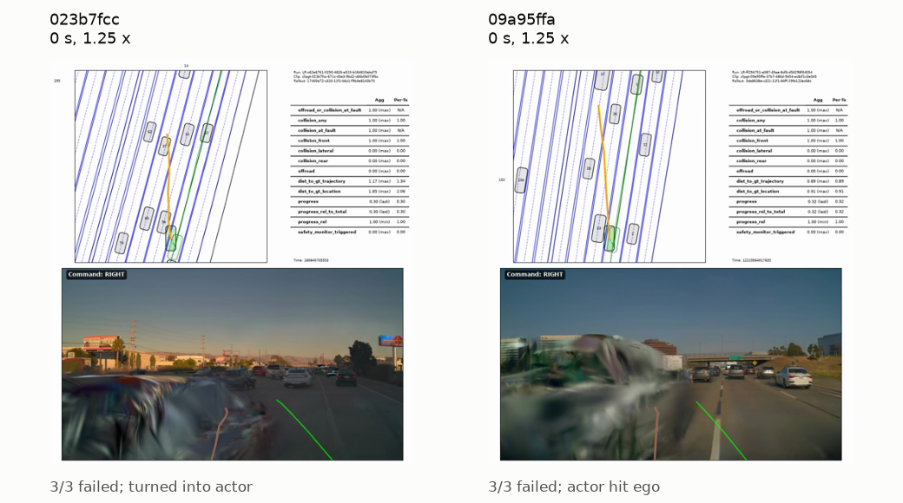
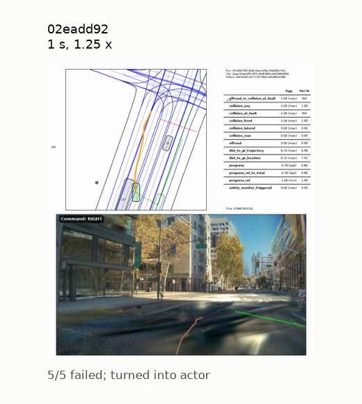
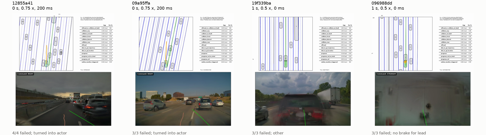
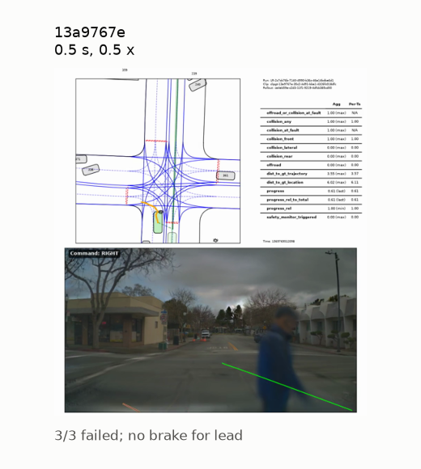
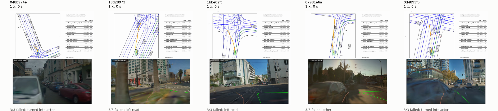

# The hardest cases found

Generated by `harness/gallery.py`: each study's confirmed hardest
settings (top_k goal, failure rate surely above the goal's bound by
repeats), each with one failed run, its camera frame and the triage.

## cut_in_merge

In merge and cut-in scenes, which timings and speeds of the other cars make the VaVAM policy collide or leave the road? Find the 5 most challenging settings, each on a different scene and confirmed by repeats.

- **023b7fcc**, 0 s, 1.25 x (3/3 failed, found by rules): turned into actor. The route said STRAIGHT and then RIGHT, but the ego planned and steered left into the next lane while speeding up from 4.2 to 5.8 m/s. Its front hit actor 56, which was driving in that lane next to it and slightly ahead. The camera only smeared at the moment of impact. (`cut_in_merge_rules_004`)
- **09a95ffa**, 0 s, 1.25 x (3/3 failed, found by rules): actor hit ego. On a multi-lane highway the ego held about 8 m/s, staying within 0.9 m of the recorded human path, with the lead car more than 24 m ahead. Actor 33 came up from behind in the lane to the left and closed in alongside the ego's front-left corner, where the contact was flagged as a front collision. The ego made no clear lateral move toward it, and the smeared car in the camera view at impact is from being so close. (`cut_in_merge_rules_007`)

## intersection

At intersections with crossing traffic, which arrival times and speeds of the recorded crossing car make the VaVAM policy collide or leave the road? Find the 5 most challenging settings, each on a different scene, confirmed by repeats.

- **02eadd92**, 1 s, 1.25 x (5/5 failed, found by hybrid): turned into actor. Despite a RIGHT command, the ego left the recorded path, which stayed in the right lanes, and steered left across lanes toward bus 127. It ran into the bus's right side while overtaking it at about 8 m/s, without braking or steering away. The ego was about 7 m off the recorded path when it hit the bus. (`intersection_hybrid_034`)

## lead_vehicle

In lead-vehicle scenes, which timing shifts and speed scalings of the recorded lead car (with up to 200 ms planner delay if needed) make VaVAM run into it? Find the 5 most challenging cases, each on a different scene, confirmed by repeats.

- **12855a41**, 0 s, 0.75 x, 200 ms (4/4 failed, found by hybrid): turned into actor. In slow highway traffic with a RIGHT command, the recorded path moved right toward the lane with actor 5. The ego instead held a path about 1.8 m to the left, straddling the boundary with the left lane, and edged left as actor 51 came up alongside in that lane, so its front-left corner hit 51 at 10.6 s. (`lead_vehicle_hybrid_025`)
- **09a95ffa**, 0 s, 0.75 x, 200 ms (3/3 failed, found by hybrid): turned into actor. On a multi-lane highway, the ego braked hard behind lead vehicle 1 (from 7.9 to about 3.6 m/s) and then steered left into the adjacent lane, even though the route command said RIGHT. Its left side hit vehicle 33, which was coming up alongside in that lane at 7.5 s; this was a lateral collision. (`lead_vehicle_hybrid_032`)
- **19f339ba**, 1 s, 0.5 x, 0 ms (3/3 failed, found by llm): other. 0.6 s into the run, still exactly on the recorded human path (0.0 m off) at a steady 18.7 m/s, the ego hit the rear of lead car 18 in its lane on the highway. The gap shrank from 13.4 m to 4.1 m in 0.5 s, so the lead was moving at almost 0 m/s, which the recorded drive doesn't show. The lead car's simulated track looks broken (a replay or initialization artifact), and no policy could have stopped from 13 m at that speed in 0.6 s. (`lead_vehicle_003`)
- **096988dd**, 1 s, 0.5 x, 0 ms (3/3 failed, found by llm): no brake for lead. In slow, rainy highway traffic, the ego kept speeding up from 3.8 to 5.4 m/s while the gap to the white utility truck ahead in its lane (actor 2) shrank steadily from 12.6 m to 4.9 m. It never braked and hit the truck's rear. The camera view was clean until the moment of impact. (`lead_vehicle_001`)

## pedestrian_crossing

Which pedestrian step-out timings (±2 s) and walking speeds (0.5x to 2x) make VaVAM hit the pedestrian or leave the road in pedestrian-crossing scenes, with the other traffic replayed as recorded? Find the 5 hardest cases, each on a different scene.

- **13a9767e**, 0.5 s, 0.5 x (3/3 failed, found by llm): no brake for lead. The ego drove about 3.5 m left of the recorded path while approaching the intersection on a RIGHT command. A pedestrian (actor 270) was walking left to right across the crosswalk directly ahead, clearly visible in the camera, and the ego hit them at about 2.9 m/s. It had slowed gradually from 7.1 m/s but never braked to a stop, even as the gap shrank from 17 m to under 3 m. (`pedestrian_crossing_023`)

## pedestrian_ego_speed

In pedestrian-crossing scenes, which combinations of ego speed at hand-off (0.6x–1.4x recorded) and pedestrian step-out time (±2 s) make the VaVAM policy with the linear MPC collide or leave the road? Find the 5 most challenging cases, each on a different scene, confirmed by repeats.

- **048b974e**, 1 x, 0 s (3/3 failed, found by rules): turned into actor. The route command was RIGHT, but the ego turned left at the intersection, off the planned path and about 6 m from the human trajectory. It kept going at about 3.5 m/s without braking and hit the front of vehicle 155 (the white van on the left of the camera view), which was stopped along the left curb of the cross street. (`pedestrian_ego_speed_rules_005`)
- **18d28973**, 1 x, 0 s (3/3 failed, found by rules): left road. The route command was RIGHT and the route ran to the right, but the ego stayed in the far-left lane at about 10 m/s. Its own plan drifted further left, and it drove up onto the tree-lined median at the intersection (offroad; about 6.1 m off the recorded human path). The camera view was clean until the ego reached the median, and no other actor was involved: the collision metrics stayed at 0 even though the failure input also flagged front and lateral collisions. (`pedestrian_ego_speed_rules_009`)
- **1bbe02fc**, 1 x, 0 s (3/3 failed, found by rules): left road. At the stop line of an intersection where the route turns right, the ego began yawing left, following a plan that cut left across the tram tracks instead of the right turn, and was flagged offroad at 5.7 s while still only about 0.6 m from the human trajectory. The route command read STRAIGHT until the failure frame and only switched to RIGHT then, and an offroad flag this close to the human path may be partly a map-boundary artifact, so blame is uncertain. (`pedestrian_ego_speed_rules_010`)
- **07981e6a**, 1 x, 0 s (3/3 failed, found by rules): other. On a narrow residential street, the route command changed from STRAIGHT to RIGHT ahead of an intersection. The human drove right, toward the turn. The ego's plan instead drifted left along the row of parked cars, and the ego kept going at about 11 m/s with almost no braking (the gap closed from 38 m to 4 m) until its front hit parked car 6. Labeled other because it drifted into a parked car rather than following a lead vehicle in its lane, and the run's offroad metric stayed at 0. (`pedestrian_ego_speed_rules_006`)
- **0d4893f5**, 1 x, 0 s (3/3 failed, found by rules): turned into actor. At a steady 8.2–8.4 m/s, the ego's plan bent left toward the adjacent lane even though the command was STRAIGHT and then RIGHT. By 6.3 s the ego had yawed left into the side of actor 33, which was driving alongside in the left lane, and it never braked. The lead vehicle (actor 4) stayed about 20 m ahead the whole time. The gap only fell to 2.2 m because actor 33 became the vehicle ahead once the ego cut into its lane. (`pedestrian_ego_speed_rules_008`)

