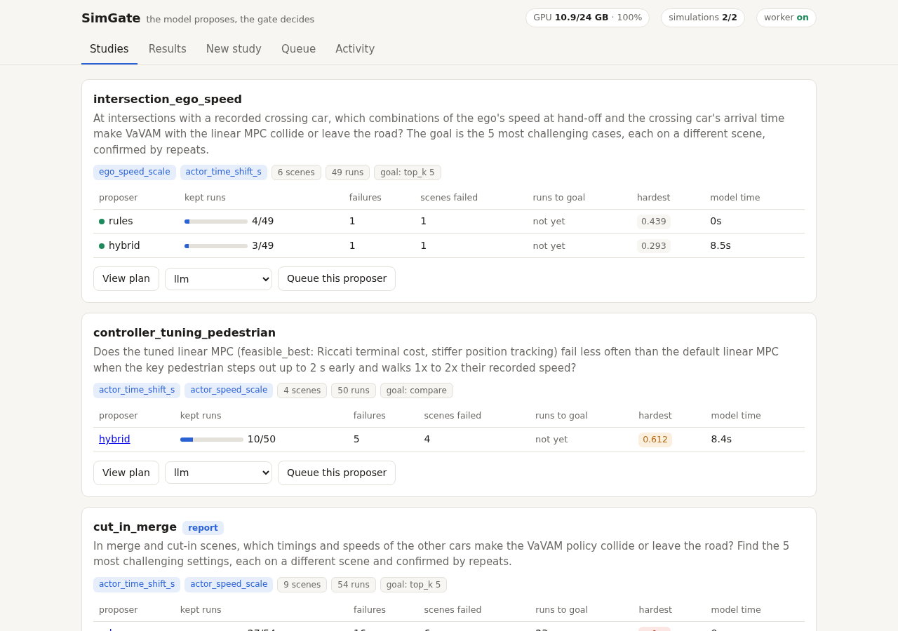
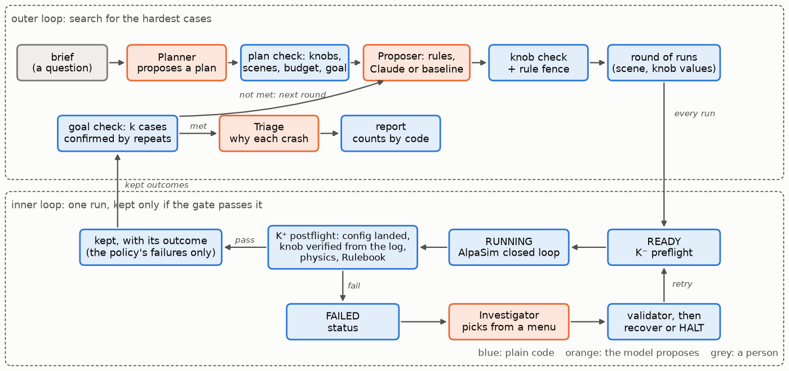
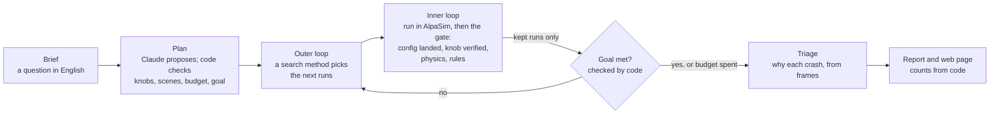

# SimGate

**Find the scenarios that break a self-driving policy, fast, with an LLM in
the loop that cannot corrupt the results.**

You ask a question in plain English: *"Which pedestrian timings and ego
speeds make the policy hit someone? Find the 5 hardest cases."* SimGate turns
it into a test plan, searches the scenario space round by round in the
[AlpaSim](https://github.com/NVlabs/alpasim) closed-loop simulator, confirms
each hard case by repeats, explains every crash from the camera frames, and
answers with a report in which every number is computed by code.

Claude helps at every step, but only proposes. Deterministic checks (the
**gate**) decide which simulation runs count: a run is kept only if the
requested scenario provably happened (read back from the run's own logs) and
the motion is physically plausible. When a run fails, the model may only
choose a fix from a fixed menu, and an exhaustive check shows no answer it
could give breaks the gate.



## What it found (Oct 2026, VaVAM driving policy, AlpaSim)

| | |
|---|---|
| **Ego speed is the stressor** | Retiming the pedestrian alone: 0-5 failures in 49 runs per method. Adding the ego's speed at hand-off: every method confirms the 5 hardest cases in 24-28 runs. |
| **A quarter of naive "failures" are not the policy's** | Counting every collision flag, 49 of 200 failures were replayed cars rear-ending a slowed ego, or contacts before the policy drove. SimGate counts only failures the policy is responsible for, from the moment it takes over. |
| **Fair baselines** | Random search found 31 crashes in 48 runs but confirmed none; `random_confirm` adds the same confirmation the rules use. Which method finds hard cases fastest is being measured over replicates of every method (`METHODS.md`). |
| **Valid by construction** | 778 runs across the studies, 759 kept (97.6%); 17 crashed launches retried automatically, 2 halted by the physics bound, none kept without passing every check. |
| **Reproducible** | A seeded run replays bit for bit (0.0 m over 122 steps); a different seed parts at 3.6 s. |

Live numbers: [`METHODS.md`](METHODS.md), [`GATE.md`](GATE.md),
[`studies/SUMMARY.md`](studies/SUMMARY.md); every measurement and its source:
[`FACTS.md`](FACTS.md). Browse every study without a GPU: the read-only
snapshot in [`site/`](site/) (`research/simgate export`).

## How it works



The same as a flow:



- **Knobs** the search may turn, each verified from the run's own log:
  planner delay (plan age), lateral bias and waypoint noise (plan offset and
  scatter), a recorded actor's timing and speed (the runtime's retiming log),
  and the ego's speed at hand-off (measured speed against the request).
- **Search methods** on the same plan, budget and gate: `llm` (Claude, free),
  `hybrid` (Claude choosing among rule candidates), `rules`, and baselines
  `random_confirm`, `random`, `grid`, `bisect`, `lhs`, `optuna`, `ga`.
- **Goals** checked by code after every round: `top_k` (the k hardest
  settings, confirmed by repeats), `bracket` (where failure starts, to a
  resolution), `separate`, `compare` (A/B of two controllers).
- **Safety model**: the gate and the loop are plain Python with tests and an
  exhaustive check over every answer a model could give; the model's
  diagnosis, audit and plans are untrusted proposals. See
  [`harness/README.md`](harness/README.md).

## Run it

Requirements: an AlpaSim checkout with its scenes, an NVIDIA GPU (24 GB runs
two simulations at once), Docker, [uv](https://docs.astral.sh/uv/), and a
logged-in `claude` CLI. Clone this repository into the checkout as
`research/`, then:

```bash
research/simgate serve      # web app at http://localhost:8765
research/simgate worker     # runs queued studies on the GPU
```

Write a brief in the app (or `research/simgate new my_question`), check the
plan Claude proposes, and queue it with one or more search methods. The
command-line equivalents, the knob catalog and the file map are in
[`harness/README.md`](harness/README.md); the whole project with diagrams in
[`GUIDE.md`](GUIDE.md); the paper plan in [`OUTLINE.md`](OUTLINE.md).

Status: research code for an IEEE IV 2027 submission, in active development.
The retiming and seed hooks it needs in AlpaSim are default-off changes to
AlpaSim's runtime (`patches/`).

---

# For the team

## Working in this repo

Start here. This folder is the only current description of Will's IEEE IV 2027 project.
The long notes at the repo root are background. If they disagree with this folder, this
folder wins.

People: Will (senior, writing the paper), Griffin (sophomore, ~10 h/week, runs batches
from the runbook), and whatever agent is in the repo. The advisor is Shao (controls,
University of Georgia). His slides from 2026-09-22 are in `source/diagrams.pdf`.

## Read order

| Who | Read | Update |
|---|---|---|
| A new LLM session | `PITCH.md`, then the board in `STATUS.md` | `STATUS.md` row and `LOG.md` when the task is done |
| Anyone about to change code or launch a run | `STATUS.md`, then `FACTS.md` | the board row it finished |
| Anyone asking "what is this project" | `GUIDE.md` (diagrams, results, slide plan); `MAP.md` is the older Loop 1 map | when a result or the claim changes |
| Will or Griffin, for the semester plan | `WEEKS.md` | when a week is replanned |
| Will, for the weekly update slides | `WEEKLY.md` (what got done, newest week first) | as work lands each week |
| Griffin, or an agent launching rollouts | `RUNBOOK.md` | when a command in it is wrong |
| Anyone tempted to re-diagnose the baseline | `FACTS.md` | when a new measurement replaces an old one |

Do not add another research markdown unless `STATUS.md` names the question it answers.

## What is current

The paper is SimGate: Loop 1 as Shao designed it on 22 Sep 2026 (preflight
K⁻, postflight K⁺, a finite skill menu), built and extended with an
investigating agent, a batch auditor, rule mining, and an exhaustive check of
the gate. Full picture: `GUIDE.md`. Claims and evidence: `OUTLINE.md`,
`FACTS.md`. Board: `STATUS.md`. Scripts from paused work are in `archive/`.

This folder is its own git repo (ignored by NVlabs AlpaSim), pushed to
https://github.com/willv678/simgate (public). New notes and harness scripts go
here so they publish without copying into `~/autolab-harness`. That older mirror is
frozen. Do not develop there. Griffin: clone or pull that repo for the week plan;
run wizard from the AlpaSim checkout.

Harness Python lives in `harness/`. Run it from the AlpaSim checkout:

```bash
cd /home/willvarner/alpasim
uv run python research/harness/analyze_cp2.py
uv run pytest research/harness/test_analyze_cp2.py
```

Edits inside AlpaSim packages stay in `../src/`. Refresh the published delta with
`./export_src_diff.sh` (writes `patches/alpasim-src.diff`).

## Background, not instructions

| File | What it still contains | What is stale |
|---|---|---|
| `paper-switching-stability.md` | The paper argument, risks, and phases | "Immediate next steps" at the bottom. Use `STATUS.md`. |
| `HANDOFF.md` | Code-level tasks and acceptance tests | The progress blurb at the bottom, and any task `STATUS.md` marks done. |
| `researchideas.md` | Why the red-team / search papers were rejected, and the rigor checklist | The eight-week plan and "next three days." |
| `paper-attribution-repair.md` | Interface interventions, kept as tools inside the stability paper | It is not the lead paper. |
| `SESSION_CHANGES.md` | What one September session changed in the controller | A session log, not a plan. |

## Rules for agents

- Python goes through `uv`. Never activate a venv. See `.cursor/rules/uv-python.mdc`.
- `src/` is upstream AlpaSim. Change it only when `STATUS.md` names the file.
- Harness scripts live in `harness/` (`analyze_cp2.py`, `download_scenes.py`, …). They can change. Do not add new experiment scripts at the AlpaSim repo root.
- The model is called only by `harness/diagnose.py` (on FAILED) and `harness/audit.py` (after a batch). Its system prompts are `harness/advisor/`. Any new model call needs a row in `STATUS.md`.
- Do not trust `cp2_failure_boundary.png` or `failure_boundary.png`. The latency axis on the historical 212 runs was parsed wrong. See `FACTS.md`.
- When you finish a task, edit `STATUS.md` in the same change: date, what was measured, where the artifact lives. A task with no artifact is not done.
