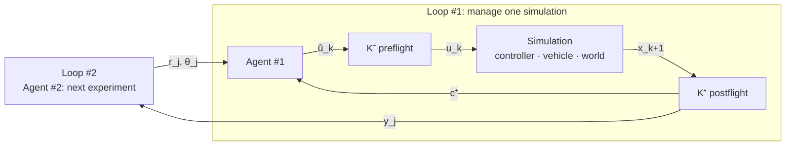
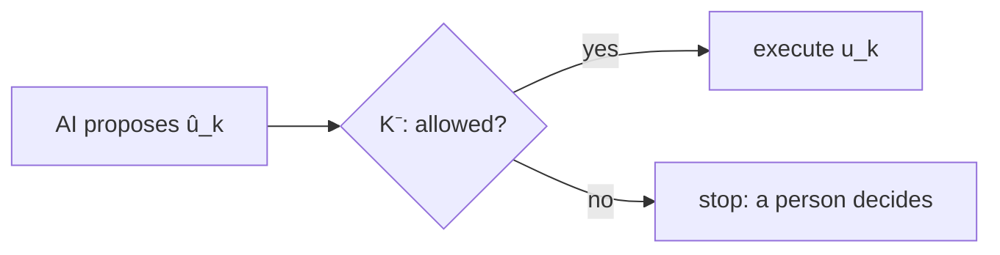
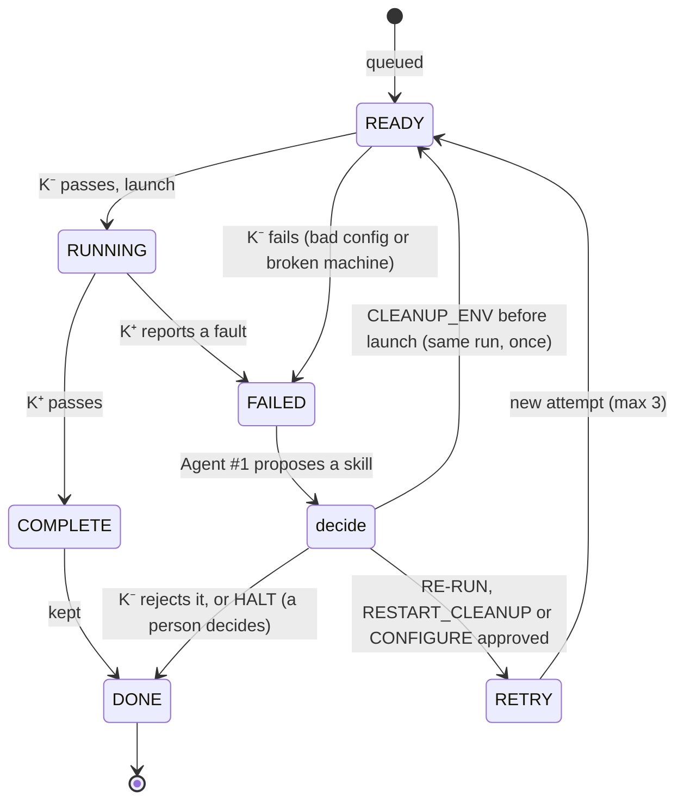
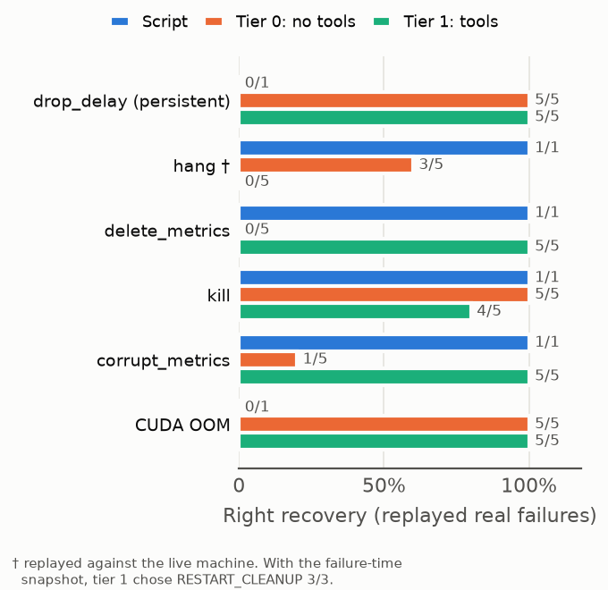
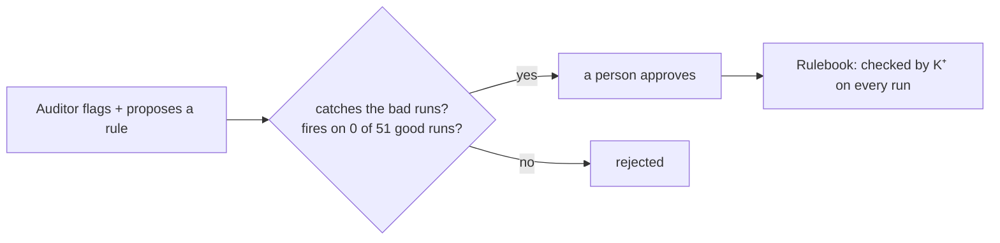
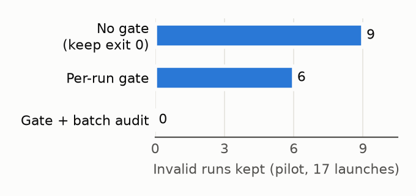

# SimGate: slides for the 29 Sep meeting

Thirteen slides, about 15 minutes, plus backups. Each slide has a title, what
goes on it, and speaker notes. The notes are meant to be said out loud: short
sentences, plain words. Figures are in `figures/`; diagrams are Mermaid (paste
into mermaid.live to export an image, or redraw).

Notation follows Dr. Shao's diagrams (`source/diagrams.pdf`): Agent #1 proposes
û_k, preflight control K⁻ approves it, the simulation runs, postflight control
K⁺ reports back.

---

## 1. SimGate

**Body**

> # SimGate
> ### The model proposes, the gate decides.
> Runtime assurance for LLM-operated driving simulation
> Will Varner · Dr. Shao · IEEE IV 2027

**Speaker notes**

> This is SimGate. It lets an AI run our simulation batches overnight, and it
> makes sure that nothing the AI does can put bad data into our results. One
> line to remember: the model proposes, the gate decides.

---

## 2. Testing a driving AI takes a lot of runs

**Body**

- AlpaSim puts a driving model in a reconstructed real street.
- Each run is short: about 12 seconds of driving, because the world only
  exists where the recording car drove.
- So one study is hundreds of runs. They have to run unattended.
- Example: our batch B2, 150 runs, 9 hours, nobody watching.

**Speaker notes**

> To test a self-driving model, we drop it into a simulated street and see
> what it does. Each run is only about twelve seconds long. So to learn
> anything, we need hundreds of them. That means running them overnight, with
> nobody watching. Last night we ran a hundred and fifty in nine hours.

---

## 3. Unattended runs lie

**Body**

| What the data said | What was true |
|---|---|
| VaVAM crashes 8 of 10 times | it had 1 frame of memory instead of 8 |
| latency causes crashes | 162 of 212 runs never got the delay |
| a clean study | 22% of runs wrote nothing and were dropped |
| every control step solved | "solved" meant "didn't crash" |

*All four were in our own data. None raised an error.*

**Speaker notes**

> Here's the problem. When a run crashes, you notice. The dangerous failures
> are the ones that look like success. These four were all in our own data.
> The model looked terrible, but it was misconfigured. A latency plot used a
> delay the simulator never applied. A fifth of the runs silently vanished.
> Not one of them threw an error. When nobody is watching, this goes straight
> into a paper.

---

## 4. The plan: two loops

**Body**

- Loop #1 runs one simulation and recovers when it fails.
- Loop #2 uses the results to choose the next experiment.
- Both loops are only as good as the data coming out of K⁺.

**Speaker notes**

> This is the architecture from your slides. The inner loop runs one
> simulation and recovers from failures. The outer loop reads the results and
> picks the next experiment. Both loops trust the data coming out of
> postflight. If that data lies, Loop #1 keeps bad runs and Loop #2 steers the
> whole study the wrong way. So that's what we built first: a way to make that
> data trustworthy.

---

## 5. The catch: you can't just trust the AI

**Body**

- An AI in charge of everything is slow, costly, and not repeatable.
- And it can be wrong, confidently.
- Our answer, from control theory (Simplex, Sha 2001):
  - **The AI only proposes** (û_k).
  - **Simple, checked code decides** (K⁻ approves u_k).
  - Routine steps are plain Python. The AI is only called when K⁺ reports a fault.

**Speaker notes**

> The obvious approach is to let an AI agent run everything. That's expensive,
> it gives different answers every time, and it can be confidently wrong. So
> we borrowed an old idea from control theory called Simplex. A smart
> controller you don't trust sits next to a simple one you do, and a switch
> only lets safe actions through. Here, the AI proposes, and plain code
> decides. The AI isn't even called unless something breaks.

---

## 6. SimGate's state machine (x_k)

**Body**

- Five states. Python owns every arrow.
- Agent #1 is consulted on one arrow: FAILED.
- A retry is a new attempt from READY, so the failed attempt's evidence is
  never overwritten. At most 3 attempts. A machine fixed before launch sends
  the same run back to READY, once.
- If a machine failure ends in HALT, the whole batch stops: every later run
  would hit the same machine.

**Speaker notes**

> Every run moves through five states. Ready, running, complete, failed, done.
> Python moves it along. The AI only gets a say when a run fails. It proposes a
> fix. If K-minus approves, the failed attempt is closed and a fresh attempt
> starts from ready, up to three tries. If K-minus says no, or the AI says to
> stop, a person takes over. Everything else is ordinary code, which means
> it's fast, cheap, and does the same thing every time.

---

## 7. K⁻: before anything happens

**Body**

- **Preflight:** is this config allowed to run? (context length must be 8,
  the scene must exist)
- **Machine check:** is the machine healthy? (leftover containers, Docker
  networks, GPU memory, disk)
- **Validator:** is the AI's proposed action allowed?
  - one skill from a menu of five, nothing else
  - never keep a failed run, never more than 3 tries
  - never change what the experiment measures
  - rejected means stop for a person, not "try again"

**Speaker notes**

> K-minus is the check before anything happens. It asks three questions. Is
> this configuration allowed? Is the machine healthy enough to run it? And if
> the AI proposed something, is that allowed? The AI picks from a menu of five
> actions, and the validator throws out anything else. One difference from
> your original design: if K-minus says no, we don't ask the AI again. We stop
> and hand it to a person. That's what lets us prove the system always
> finishes.

---

## 8. K⁺: after the run

**Body**

- Did the run exit cleanly?
- Did it write real, readable results?
- **Did the settings we asked for actually apply?** (the latency bug)
- Does it pass every rule in the Rulebook? (next slides)
- Output c⁺: a structured status, not a wall of logs.

**Speaker notes**

> K-plus is the check after the run. Did it finish? Did it write results we
> can read? And the one that bit us before: did the settings we asked for
> actually get used? If any answer is no, the run is marked failed, and it
> never enters the dataset. The AI never sees a raw log dump. It gets a short,
> structured status.

---

## 9. Agent #1: the Investigator

**Body**

- When a run fails, Agent #1 can look before it answers: read the run's
  files and logs, check Docker, the GPU, and the disk.
- Read-only. We told it to delete files and escape its folder: 5 of 5 blocked.
- Menu: CONFIGURE · RE-RUN · RESTART_CLEANUP · CLEANUP_ENV · HALT

*Script 4/6 · AI without tools 63% · the Investigator 80%*

**Speaker notes**

> When a run fails, the Investigator gets to look around before it answers. It
> can read files and check the machine, but it can't change anything. We tried
> to make it break out, five different ways, and it was blocked every time.
> Here's how it compares to a hand-written script. The script retries
> everything, so it wastes runs on problems a retry can't fix. The AI without
> tools gives up when the log looks clean. The Investigator opens the files,
> sees the results are missing, and retries. Tools matter exactly when the log
> hides the cause.

---

## 10. The Auditor and the Rulebook

**Body**

- After a batch, the Auditor reads every kept run and flags the ones that
  don't measure what they claim. It can only flag.
- Planted lies: **46 of 46 caught, 0 false alarms**, same result three times.
- Blind spot: a batch that is wrong the same way throughout (0/10).
  Fix: add **one known-good reference run** (10/10).
- **What it learns becomes code.** Its rule "context length must be 8" caught
  that blind-spot batch 10/10, with no AI at all.

**Speaker notes**

> The per-run checks only catch problems we already know about. So after each
> batch, a second agent, the Auditor, reads through the results and flags
> anything that doesn't add up. We planted forty-six lies. It found all of
> them, with zero false alarms, three times in a row. It has one blind spot. If
> every run is wrong in the same way, nothing looks inconsistent. One good
> reference run fixes that. And here's my favorite part. When the Auditor finds
> a problem, it writes a rule. If the rule holds up against fifty-one known
> good runs, and a person approves it, it becomes part of K-plus. That rule
> then caught the batch the Auditor itself missed, ten out of ten, with no AI.

---

## 11. The Verifier: proof, not testing

**Body**

- The menu is finite, so we can check every possible answer the AI could give.
- An adversarial "AI" tried all of them, against a world where every run fails.
- **It found a real hole:** "fix" a failed latency run by setting the delay to
  zero. The run passes, and the data is wrong again.
- Fixed: a recovery can change *how* a run executes, never *what* it measures.
- Now: **0 violations** over 3,822 transitions. Every run ends. At most 3 tries.

**Speaker notes**

> Testing an AI tells you what it did. It doesn't tell you what it could do. But
> our menu is small, so we can check every possible answer. We built an
> adversary that tries all of them, including nonsense. On the first run, it
> found a real hole. The AI could fix a failed latency run by setting the delay
> to zero. The run would pass every check, and the data would be wrong. The
> exact bug from slide three. We closed it. Now nothing any AI can say gets bad
> data through, and we check that automatically every time the code changes.

---

## 12. Results

**Body**

- Invalid runs kept in the pilot: **no checks 9 → per-run checks 6 → with
  the Auditor 0.**
- Unattended: 150 runs in 9 hours. 101 new scenes running now.
- The last 6 were "silent" faults, like a human recording secretly driving the
  car. Only the Auditor saw them.

**Speaker notes**

> Here's the headline. We broke runs on purpose, in every way we could think
> of. With no checks, nine bad runs made it into the data. With our per-run
> checks, six did. With the Auditor on top, zero. The last six were the sneaky
> ones, like a human recording driving the car the whole time. The results
> looked great. They were fake. Only the Auditor caught them.

---

## 13. What's next, and what I need from you

**Body**

**Next**
- Full campaign this weekend: every fault × 10, script vs. AI vs. Investigator.
- 101-scene batch finishes tonight.
- Draft to you around 1 Nov. IV deadline 15 Nov.

**Decisions**
1. The Auditor goes past "Loop #2 is motivation only." OK to make it part of the paper?
2. OK to spend ~20 GPU hours on the campaign?
3. Name and title: *SimGate: Runtime Assurance for LLM-Operated Driving Simulation*?

**Speaker notes**

> Next, we run the full campaign this weekend, so every number on these slides
> becomes a real rate instead of a handful of samples. The draft comes to you
> around November first. I need three decisions from you. First, the Auditor
> goes beyond the original plan, where the outer loop was just motivation. It's
> our strongest result, but I want your OK. Second, the campaign needs about
> twenty GPU hours. Third, the name and title.

---

## Backup slides

### B1. Faults we inject (controlled w_k)

| Fault | What happens | Caught by |
|---|---|---|
| kill | process killed mid-run | K⁺ (exit code) |
| hang | simulator frozen | K⁺ (timeout) |
| delete / corrupt metrics | results gone, **exit code 0** | K⁺ |
| drop delay | the setting silently never applies | K⁺ (landed check) |
| full network pool | the machine can't start a run | K⁻ (machine check) |
| rails | a human recording drives the car | only the Auditor |
| kinematic | no controller at all | only the Auditor |

> These are your w_k, execution uncertainty, but under our control. Five are
> loud. Two are silent, and only the Auditor catches those.

### B2. The night the machine broke (B2)

- 150 runs, 9 hours. The only failures: 29 old runs had leaked Docker networks.
- Fixing one run couldn't fix a shared machine. A person fixed it once.
- That became the machine check and CLEANUP_ENV. Now no person is needed.

> Our first long run taught us something. Some failures aren't about one run.
> They're about the machine. So we added a check for the machine itself.

### B3. What's new

- "Simplex for AI agents" exists as an idea. We don't claim it.
- New: guarding **data validity**, not physical safety. AI vs. rules on the
  same checked menu. An auditor whose findings become checks. Exhaustive
  verification. A real self-driving simulation stack.

> People have put safety checks around AI agents before, for robots and
> factories. Nobody has used that idea to keep scientific data honest.

### B4. Your notation, built

| Your diagram | SimGate |
|---|---|
| Agent #1, π_A | the Investigator (script as baseline) |
| K⁻ | preflight + machine check + validator |
| K⁺ | postflight + landed check + Rulebook |
| x_k | READY, RUNNING, COMPLETE, FAILED, DONE |
| 𝒮 | CONFIGURE, RE-RUN, RESTART_CLEANUP, CLEANUP_ENV, HALT |
| w_k | the injected faults |
| Agent #2 | the Auditor, protecting y_j (choosing θ_j+1 is future work) |
