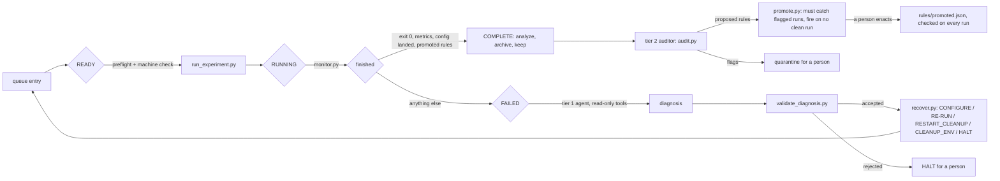
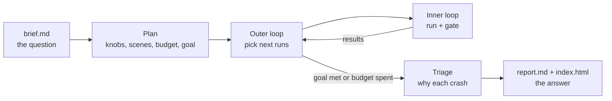

# SimGate: the model proposes, the gate decides

An unattended batch runner for the [AlpaSim](https://github.com/NVlabs/alpasim)
driving simulator in which an LLM (Claude, via `claude -p`) operates the batch
without being trusted. Deterministic checks decide which runs enter the
dataset. The model only proposes: a recovery from a finite menu when a run
fails, quarantine flags when a batch finishes, and new checks. Nothing it
proposes takes effect until a gate that does not depend on it admits it.

This is the Simplex architecture (Sha, 2001) moved from physical safety to
experimental validity: the invariant is that no invalid run is kept.

SimGate's parts: **the Gate** (every check a kept run passes), **the
Investigator** (tier 1 diagnosis of failed runs), **the Auditor** (tier 2 batch
review), **the Rulebook** (the Auditor's admitted rules, enforced by the Gate),
and **the Verifier** (the exhaustive check of the Gate). See `../GUIDE.md`.



## Studies: from a question to an answer

The loop above runs one queue of runs. A **study** wraps it: a researcher
writes a short brief in plain English, and the system designs the tests, runs
them round by round, explains the crashes, and answers the question. At every
step a model proposes and code decides.



- **Plan** (`study.py`, `advisor/PLAN.md`): Claude turns the brief into knobs,
  scenes, rounds and a goal; `plan_problems` checks it against the knob
  catalog, the scenes and a 60-run cap before anything runs.
- **Knobs** (`knobs.py`): only settings the gate can verify from the run's own
  log: planner delay (plan age), lateral bias and waypoint noise on the plan
  (offset and scatter), actor retiming (time shift and speed of a recorded
  actor class, with traffic replayed; AlpaSim's `actor_retiming` hook), and
  the ego's speed at hand-off (`ego_speed_scale`: the recorded warm-up replayed
  that many times as fast, reaching the recorded hand-off pose on time;
  AlpaSim's `ego_speed_scale`, checked by the runtime's "Retimed ego" line and
  the ego's logged speed before the hand-off against the recording's).
- **Seeds** (`replay.py`, `check_replay.py`): every study run carries a `seed`
  in its queue config, a hash of the study's name and the run's number, unless
  plan.json says `"seeded": false`. The wizard gets
  `+runtime.simulation_config.random_seed=<seed>` (AlpaSim's
  `RolloutSpec.random_seed`) and `+driver.model.force_determinism=true` (VaVAM
  draws each plan's noise from the session seed plus its inference count); the
  gate checks both resolved and that the log's driver and traffic session
  requests carry the seed. `replay.py <entry.json> <queue>` queues a kept run
  again with the same config; `check_replay.py <run_a> <run_b>` says whether
  two runs match and where they first part (frames, plans or poses).
- **Outer loop** (`outer.py`): each round a proposer picks runs: `llm`
  (Claude, free), `hybrid` (Claude, only among rule candidates), `rules`
  (`guided.py`, no model), or the baselines `grid`, `bisect`, `random`, `lhs`,
  `optuna`, `ga` (`baselines.py`). All share the same knob check, gate and goal.
- **Goal** (`goals.py`): checked by code after every round; the study stops
  when it is met. `separate` (two settings' failure rates differ), `bracket`
  (where each scene starts to fail, to a set resolution), `top_k` (the k most
  challenging settings, confirmed by repeats), `compare` (which of two
  controllers fails less, below). Failure rates carry 90% ranges; each run has
  a criticality (1 for a crash, up to 0.9 for a near miss).
- **A/B studies** ("which controller is safer?"): the plan fixes
  `compare: {"a": "linear", "b": "nonlinear"}` (controllers from
  `knobs.CONTROLLERS`, AlpaSim's `controller=` configs). The search over
  scenes and knobs runs as usual, but every proposed setting runs once per
  controller, a pair with the same scene and knob values (`<study>_007_linear`,
  `<study>_007_nonlinear`). The `compare` goal pools each controller's
  failures over the paired runs and is met when the 90% ranges separate,
  otherwise "no difference shown"; code adds an exact sign test over the pairs
  where only one failed. Tables and the report show a and b side by side.
  Every run records its `controller`, and postflight checks the resolved one
  is the one asked for (entries without the key asked for linear); the
  promoted rule pinning the linear MPC applies only to runs that asked for
  linear (`when` in `rules.py`).
- **Triage** (`triage.py`, `advisor/TRIAGE.md`): Claude reads frames around each
  crash and names the cause; crashes far off the recorded path are flagged as
  possibly the simulator's.
- **Report** (`study.py`, `advisor/REPORT.md`, `study_page.py`): Claude answers
  citing settings; every count is printed by code, and a report that writes
  counts by hand is refused. `study_page.py` makes a web page per study.

```bash
uv run python research/harness/study.py research/briefs/latency_budget.md --plan-only
uv run python research/harness/study.py research/briefs/latency_budget.md --yes
uv run python research/harness/study.py research/briefs/latency_budget.md --proposer rules --yes
uv run python research/harness/study.py research/briefs/ab/controller_pedestrian.md --plan-only
uv run --with optuna python research/harness/study.py <brief> --proposer optuna --yes
uv run python research/harness/study_page.py research/studies/latency_budget
```

## Safety model

| Layer | Trusted? | What bounds it |
|---|---|---|
| `loop.py`, `read_state.py`, preflight, postflight, rules | yes, plain Python | tests; `verify_supervisor.py` |
| Tier 1 diagnosis (`diagnose.py --policy agent`) | no | finite menu, JSON schema, `validate_diagnosis.py`; read-only tools in a fence (`probe_fence.py`) |
| Tier 2 audit (`audit.py`) | no | can only flag; sees an anonymized snapshot |
| Rule proposals | no | `promote.py` admits against a clean corpus; a person enacts |

`verify_supervisor.py` checks the gate against every answer a policy could
give, from every kind of failure, in a world that fails every launch. No failed
run is kept, no rejected config launches, no run launches more than three
times, every path ends, and no recovery changes what a run measures.

## Quickstart

From the AlpaSim checkout, with `uv` and a logged-in `claude` CLI:

```bash
uv run --with optuna pytest research/harness       # 217 tests, includes the exhaustive check
uv run python research/harness/enqueue_scenes.py research/harness/s1_queue s1
uv run python research/harness/loop.py research/harness/s1_queue --policy agent \
    --trace research/harness/s1_trace.jsonl         # script | model | agent
uv run python research/harness/audit.py research/harness/s1_queue
```

Fault-injection campaign (kill, hang, deleted or corrupt metrics, dropped delay,
full Docker network pool, rails, which passes every per-run check, and the
kinematic controller, which the landed check now catches):

```bash
uv run python research/harness/enqueue_campaign.py research/harness/c1_queue c1 --per-kind 10 --clean 20
uv run python research/harness/loop.py research/harness/c1_queue --policy agent --timeout-min 10 \
    --trace research/harness/c1_trace.jsonl
uv run python research/harness/score_campaign.py research/harness/c1_queue
```

## Files

| File | Role |
|---|---|
| `loop.py` | the state machine; one run in flight at a time |
| `read_state.py` | READY / RUNNING / COMPLETE / FAILED / DONE from the files a run leaves |
| `preflight.py`, `postflight.py`, `environment.py`, `rules.py`, `physics.py` | the checks; `physics.py` rebuilds the motion from the rollout log, including the plan's age, offset and scatter against what the run asked for (bounds in `rules/physics.json`) |
| `run_experiment.py`, `monitor.py`, `analyze.py`, `archive.py` | the Python-only states |
| `diagnose.py`, `validate_diagnosis.py`, `recover.py` | the FAILED branch |
| `advisor/CLAUDE.md`, `advisor/AUDIT.md` | the only system prompts the model sees |
| `audit.py`, `promote.py` | tier 2 audit and rule admission |
| `faults.py`, `enqueue_campaign.py`, `score_campaign.py`, `campaign_report.py`, `run_campaign.sh`, `run_c3.sh`, `run_c4.sh` | fault injection, campaigns, and scoring by outcome |
| `study.py`, `headless.py`, `advisor/PLAN.md`, `advisor/REPORT.md`, `../briefs/` | a study from a researcher's brief; everything in `../studies/<brief>/` (see Studies above) |
| `outer.py`, `knobs.py`, `goals.py`, `guided.py`, `baselines.py`, `advisor/OUTER.md` | the outer loop, its knob catalog, code-checked goals, rule-guided candidates, and baseline proposers |
| `triage.py`, `advisor/TRIAGE.md`, `study_page.py` | crash explanations and the study web page |
| `compare_frames.py`, `jerk_separation.py` | analyses: VaVAM with fresh vs stale frames; why jerk cannot separate the kinematic fault |
| `replay.py`, `check_replay.py` | re-run a kept seeded run, and compare two runs step by step |
| `verify_supervisor.py`, `probe_fence.py` | checks on the gate and on the agent's fence |
| `eval_auditor.py`, `eval_mining.py`, `repeat_auditor.py`, `compare_policies.py`, `repeat_tiers.py`, `calibrate_physics.py`, `eval_physics_audit.py`, `eval_plan_audit.py` | the evaluations |
| `plot_results.py`, `plot_campaign.py`, `plot_architecture.py`, `rebuild.sh` | the paper's figures, into `../figures/`; `rebuild.sh` reruns the tests and every model-free table and figure |

Results and their sources are in `../FACTS.md`; the paper plan is `../OUTLINE.md`.
