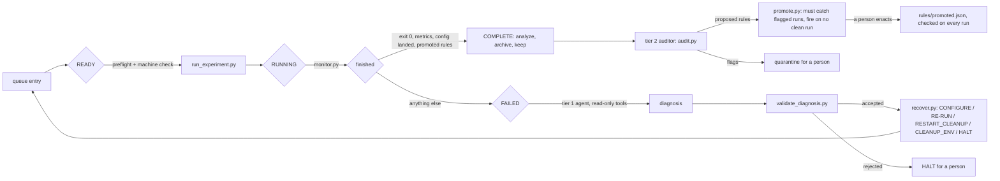

# SimGate: the model proposes, the gate decides

An unattended batch runner for the [AlpaSim](https://github.com/NVlabs/alpasim)
driving simulator in which an LLM (Claude, via `claude -p`) operates the batch
without being trusted. Deterministic checks decide which runs enter the
dataset. The model only proposes: a recovery from a finite menu when a run
fails, quarantine flags when a batch finishes, and new checks. Nothing it
proposes takes effect until a gate that does not depend on it admits it.

This is the Simplex architecture (Sha, 2001) moved from physical safety to
experimental validity: the invariant is that no invalid run is kept.

SimGate's parts: **the Gate** (every check a kept run passes), **the
Investigator** (tier 1 diagnosis of failed runs), **the Auditor** (tier 2 batch
review), **the Rulebook** (the Auditor's admitted rules, enforced by the Gate),
and **the Verifier** (the exhaustive check of the Gate). See `../GUIDE.md`.



## Safety model

| Layer | Trusted? | What bounds it |
|---|---|---|
| `loop.py`, `read_state.py`, preflight, postflight, rules | yes, plain Python | tests; `verify_supervisor.py` |
| Tier 1 diagnosis (`diagnose.py --policy agent`) | no | finite menu, JSON schema, `validate_diagnosis.py`; read-only tools in a fence (`probe_fence.py`) |
| Tier 2 audit (`audit.py`) | no | can only flag; sees an anonymized snapshot |
| Rule proposals | no | `promote.py` admits against a clean corpus; a person enacts |

`verify_supervisor.py` checks the gate against every answer a policy could
give, from every kind of failure, in a world that fails every launch. No failed
run is kept, no rejected config launches, no run launches more than three
times, every path ends, and no recovery changes what a run measures.

## Quickstart

From the AlpaSim checkout, with `uv` and a logged-in `claude` CLI:

```bash
uv run pytest research/harness                      # 131 tests, includes the exhaustive check
uv run python research/harness/enqueue_scenes.py research/harness/s1_queue s1
uv run python research/harness/loop.py research/harness/s1_queue --policy agent \
    --trace research/harness/s1_trace.jsonl         # script | model | agent
uv run python research/harness/audit.py research/harness/s1_queue
```

Fault-injection campaign (kill, hang, deleted or corrupt metrics, dropped delay,
full Docker network pool, and two silent faults that pass every per-run check):

```bash
uv run python research/harness/enqueue_campaign.py research/harness/c1_queue c1 --per-kind 10 --clean 20
uv run python research/harness/loop.py research/harness/c1_queue --policy agent --timeout-min 10 \
    --trace research/harness/c1_trace.jsonl
uv run python research/harness/score_campaign.py research/harness/c1_queue
```

## Files

| File | Role |
|---|---|
| `loop.py` | the state machine; one run in flight at a time |
| `read_state.py` | READY / RUNNING / COMPLETE / FAILED / DONE from the files a run leaves |
| `preflight.py`, `postflight.py`, `environment.py`, `rules.py`, `physics.py` | the checks; `physics.py` rebuilds the motion from the rollout log (bounds in `rules/physics.json`, off unless enabled) |
| `run_experiment.py`, `monitor.py`, `analyze.py`, `archive.py` | the Python-only states |
| `diagnose.py`, `validate_diagnosis.py`, `recover.py` | the FAILED branch |
| `advisor/CLAUDE.md`, `advisor/AUDIT.md` | the only system prompts the model sees |
| `audit.py`, `promote.py` | tier 2 audit and rule admission |
| `faults.py`, `enqueue_campaign.py`, `score_campaign.py`, `campaign_report.py`, `run_campaign.sh`, `run_c3.sh`, `run_c4.sh` | fault injection, campaigns, and scoring by outcome |
| `verify_supervisor.py`, `probe_fence.py` | checks on the gate and on the agent's fence |
| `eval_auditor.py`, `eval_mining.py`, `repeat_auditor.py`, `compare_policies.py`, `repeat_tiers.py`, `calibrate_physics.py`, `eval_physics_audit.py`, `eval_plan_audit.py` | the evaluations |
| `plot_results.py`, `plot_campaign.py`, `plot_architecture.py`, `rebuild.sh` | the paper's figures, into `../figures/`; `rebuild.sh` reruns the tests and every model-free table and figure |

Results and their sources are in `../FACTS.md`; the paper plan is `../OUTLINE.md`.
